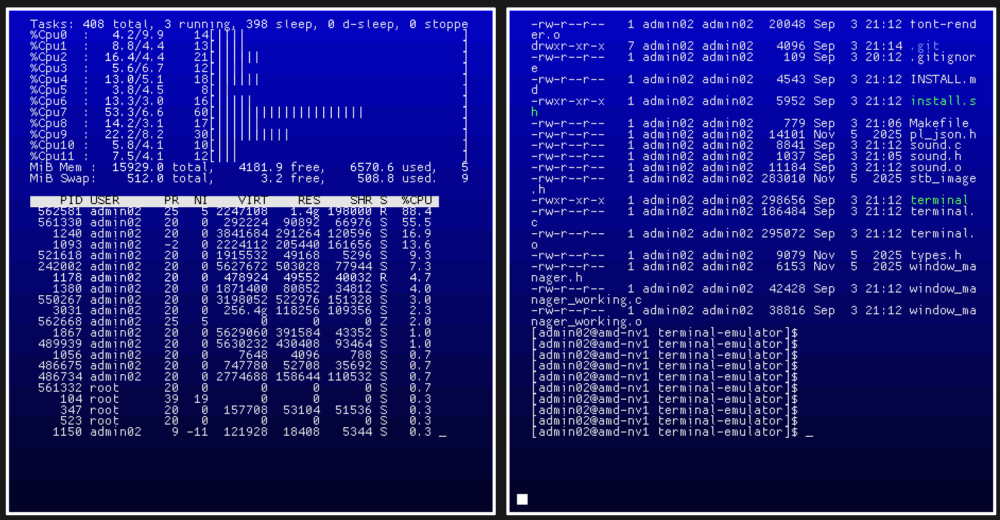
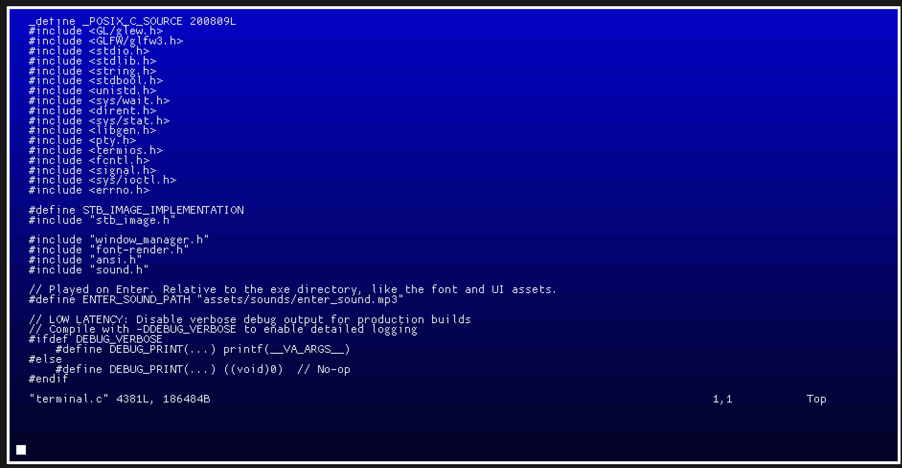
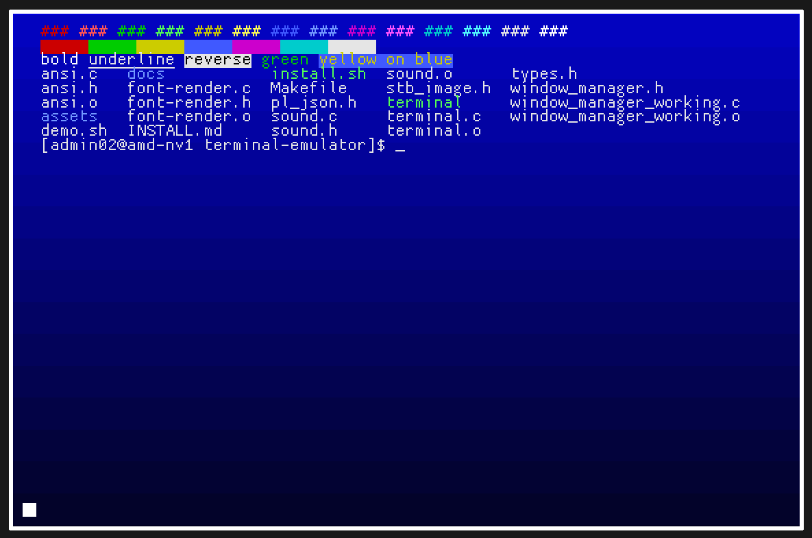
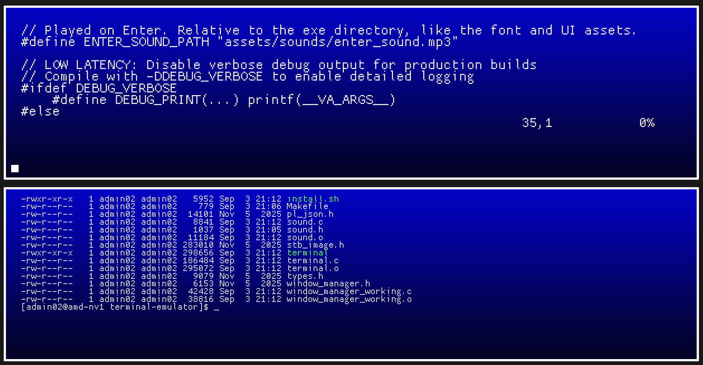
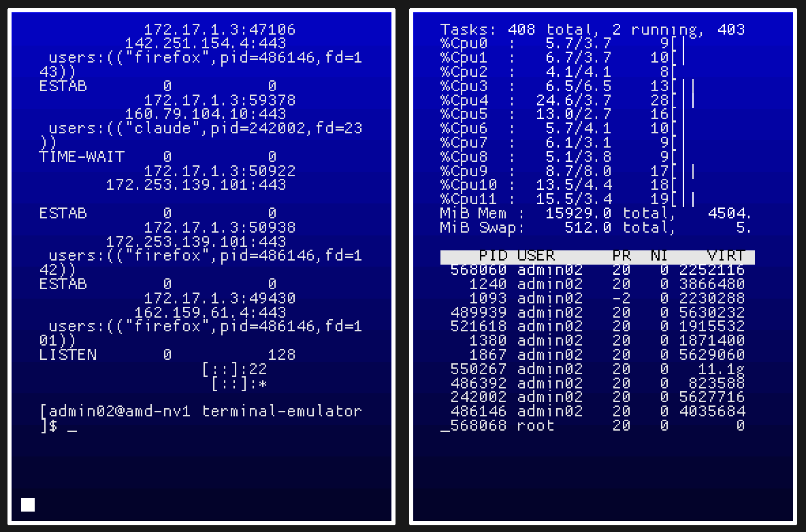
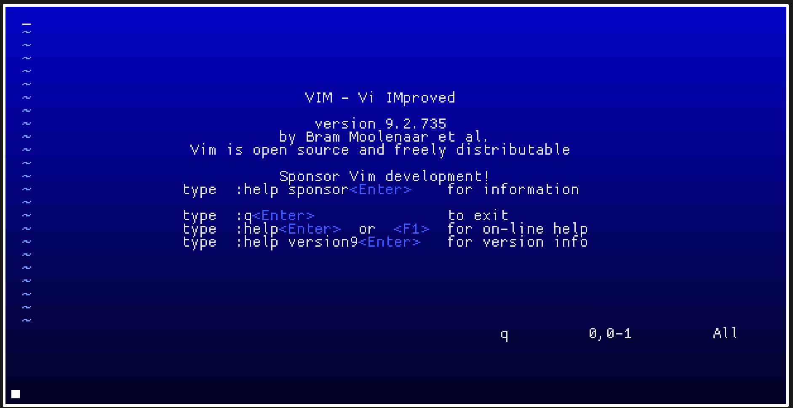

# Terminal Emulator

A terminal emulator written in C. It draws the text itself with OpenGL, runs a
real shell, and opens straight into bash.



## What it does

- Opens bash on start, and falls back to sh if bash is missing
- 16 ANSI colours, plus bold, underline and reverse video
- Runs full-screen programs: vim, less, top, htop, ssh
- Keeps your scrollback safe while those programs are open
- Splits the window in two, side by side or stacked
- Tab completion, command history, mouse wheel scrolling
- Plays a sound on Enter, which you can switch off in the right-click menu

## Build

Install the libraries for your system, then run `make`.

**Debian / Ubuntu**

```bash
sudo apt install build-essential libglfw3-dev libglew-dev \
    libgl1-mesa-dev libglu1-mesa-dev libasound2-dev libmpg123-dev
```

**Arch**

```bash
sudo pacman -S --needed base-devel glfw-x11 glew mesa glu alsa-lib mpg123
```

**Fedora**

```bash
sudo dnf install gcc make glfw-devel glew-devel \
    mesa-libGL-devel mesa-libGLU-devel alsa-lib-devel mpg123-devel
```

Then build and run:

```bash
make
./terminal
```

Run it from the project folder so it can find `assets/`. `./install.sh` will
install the libraries and build it for you.

## Keys

| Key | What it does |
| --- | --- |
| `Ctrl+Q` | Quit |
| `F8` / `F9` | Bigger / smaller text |
| `Tab` | Complete a filename |
| `Page Up` / `Page Down` | Scroll |
| Right click | Menu: split, close split, sound, font size |

## More screenshots

Editing its own source code:



Colours, bold, underline and reverse video:



The same window split top and bottom instead:



Each half is a separate shell, so you can run two things at once:



vim, running full screen. Quit it and your scrollback is still there:



## Notes

Linux only, X11 or XWayland. Needs a GPU that can do OpenGL 2.1.
`INSTALL.md` has longer setup notes and troubleshooting.
